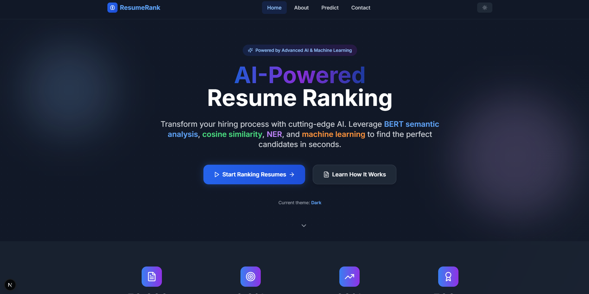
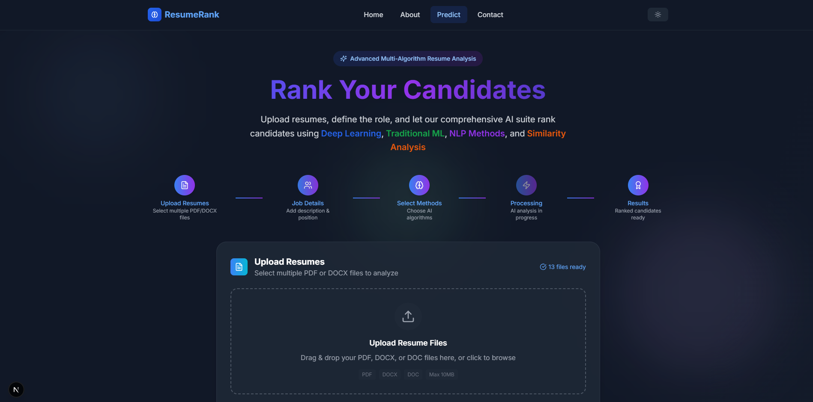
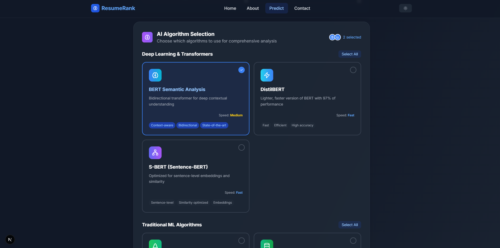
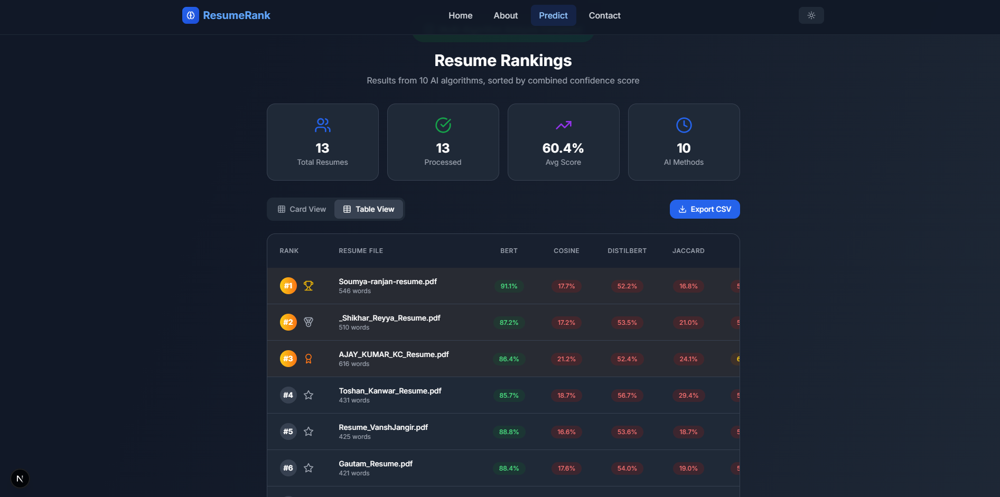

# AI-Powered Resume Ranking System

An intelligent resume screening system that uses multiple ML algorithms to automate candidate evaluation and provide transparent rankings for recruiters.

[](https://www.python.org/)
[](LICENSE)

## 🎯 Overview

This project automates resume screening by combining semantic understanding (BERT/Sentence-BERT), keyword matching (TF-IDF), skill coverage (Jaccard), and entity extraction (NER) to rank candidates against job descriptions. The system processes multiple resumes in parallel and provides explainable scores for each candidate.

### Key Features

- **Multi-Algorithm Ensemble**: Combines transformer models, TF-IDF, and NER for robust ranking
- **Semantic Matching**: BERT and Sentence-BERT capture meaning beyond exact keywords
- **Keyword Precision**: TF-IDF highlights exact skill and tool matches
- **Skill Validation**: Jaccard similarity enforces must-have requirements
- **Explainable Results**: Shows contribution from each algorithm per resume
- **Batch Processing**: Parallel execution for efficient multi-resume evaluation
- **Web Interface**: React frontend for easy job description and resume uploads
## 📸 Screenshots

### Home Page


### Prediction Page


### Algorithm Selection


### Result For 10 algo


### Result Table View


## 🧠 How It Works

### Algorithms

1. **BERT/DistilBERT**: Encodes text into contextual embeddings, measures semantic similarity with cosine
2. **Sentence-BERT (all-MiniLM-L6-v2)**: Fast 384-dim sentence embeddings for section-aware matching
3. **TF-IDF + Cosine**: Vectorizes terms, compares keyword overlap between JD and resumes
4. **Jaccard Similarity**: Strict skill set comparison with must-have enforcement
5. **NER (spaCy)**: Extracts skills, titles, certifications, and experience for structured matching
6. **ML Classifier (Optional)**: Trained model (XGBoost/RF/SVM/NN) outputs probability score

### Score Combination

Final Score = 0.25×BERT + 0.25×SBERT + 0.20×TF-IDF + 0.10×Jaccard + 0.10×NER + 0.10×ML


Scores are normalized to [0,1], and penalties are applied for missing must-have skills.

## 🚀 Installation

### Prerequisites

- Python 3.8+
- 4GB+ RAM (for transformer models)

### Setup

Clone repository
```bash
git clone https://github.com/toshankanwar/Resume-Ranking-System.git
cd Resume-Ranking-System
```
Create virtual environment
```bash
python -m venv venv
source venv/bin/activate # Windows: venv\Scripts\activate
```
Install dependencies
```bash
pip install -r requirements.txt
```

Download models
```bash
python -m spacy download en_core_web_sm
```


### Requirements.txt

torch>=1.9.0
transformers>=4.20.0
sentence-transformers>=2.2.0
scikit-learn>=1.0.0
spacy>=3.0.0
nltk>=3.6
flask>=2.0.0
PyPDF2>=2.0.0
python-docx>=0.8.11
numpy>=1.21.0
pandas>=1.3.0


## 🛠️ Technology Stack

**Backend**: Python, Transformers, Sentence-Transformers, scikit-learn, spaCy, NLTK, Flask  
**Frontend**: React.js, Axios, Material-UI  
**ML/DL**: PyTorch, XGBoost  

## 📊 Dataset

Resumes collected from:
- **LinkedIn**: Public professional profiles with consent
- **GitHub**: Developer profiles with project contributions
- **Academic Networks**: University career services and peer referrals

All data anonymized (PII removed, locations generalized, consent obtained).


## 🤝 Contributing

1. Fork the repo
2. Create your branch (`git checkout -b feature/NewFeature`)
3. Commit changes (`git commit -m 'Add NewFeature'`)
4. Push to branch (`git push origin feature/NewFeature`)
5. Open a Pull Request

## 📧 Contact

Name: Toshan Kanwar 
Email: contact@toshankanwar.website  
GitHub: [@toshankanwar](https://github.com/toshankanwar)

## 🙏 Acknowledgments

- Hugging Face Transformers
- Sentence-Transformers (UKP Lab)
- spaCy NLP library
- Research papers on AI resume screening

---

⭐ **Star this repo if you find it useful!**


